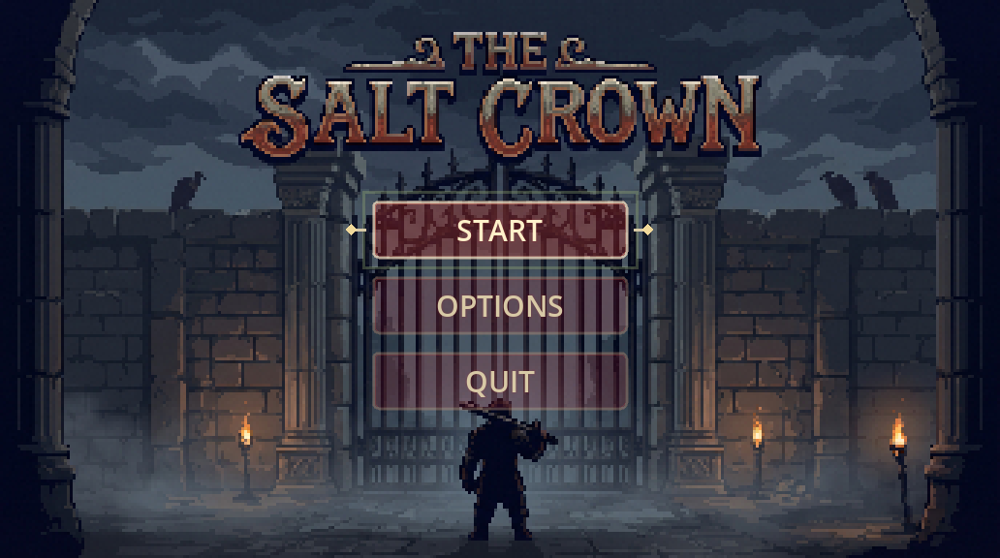
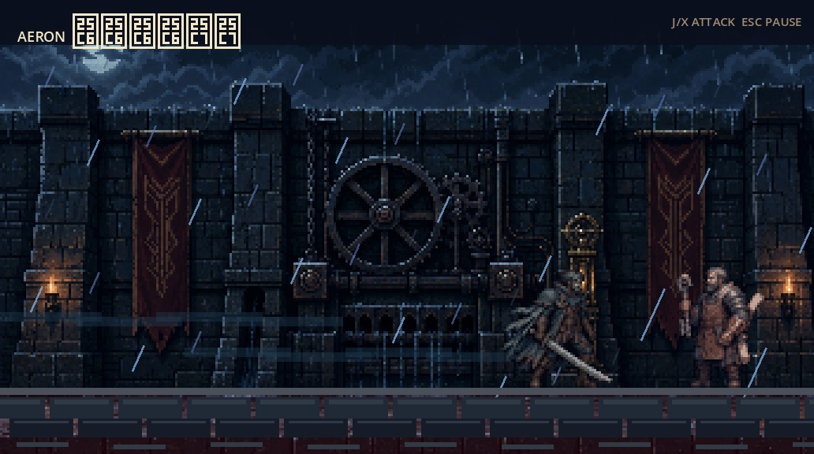
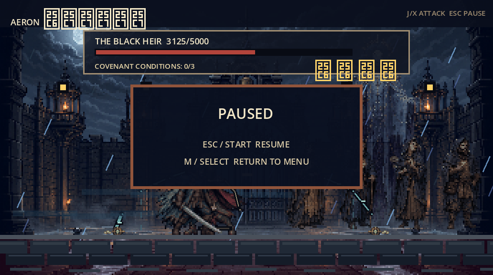
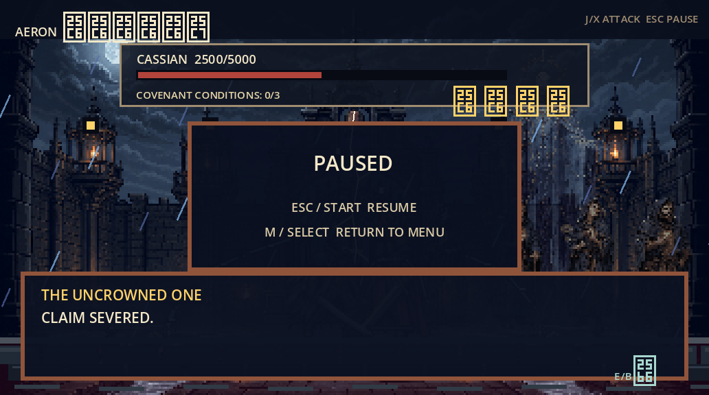
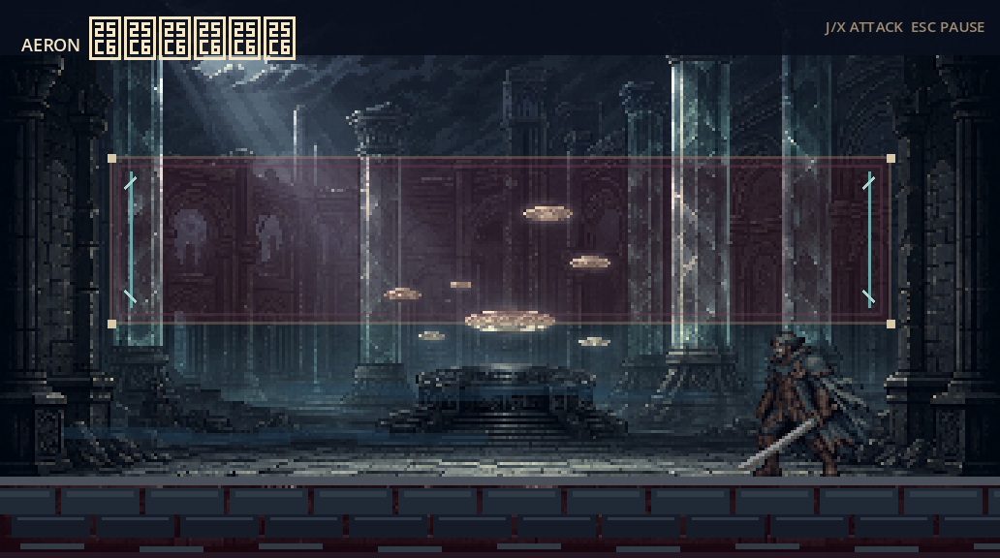

# The Salt Crown - HTB CTF Walkthrough (In Progress)

| Field | Value |
|---|---|
| Challenge type | GamePwn (Godot 4.7 game running under Wine, custom GDExtension) |
| Tech stack | Godot 4.7 custom engine build, C++ GDExtension ("ChallengeCore"), Windows PE binaries run via Wine on Linux |
| Status | Main boss encounter defeated via native memory-corruption style exploit. Final room past the boss gate not yet solved - flag not yet obtained |
| Vulnerability chain | Runtime-decompressing packer stub hides the real GDExtension code -> dumped it live from process memory -> decompiled with Ghidra -> found the `submit_event(opcode, arg0, arg1)` dispatch table -> called it directly via GDB with crafted opcodes to force the boss encounter's win condition without playing the fight legitimately |
| Flag | Not yet found - writeup documents progress so far |

This is being written up mid-challenge at the user's request, to capture the methodology before
continuing. The second half (a room called "The Claimant's Forecourt", reached immediately after
beating the boss) is still blocking further progress and is described in the "Current Blocker"
section at the end.

---

## Overview - How The Game Works

"The Salt Crown" ships as two files: `The Salt Crown.exe` (a ~70MB Godot 4.7 export, custom-built
engine) and `challenge_core.windows.template_release.x86_64.dll` (a small ~208KB GDExtension).
It's a 2D pixel-art side-scrolling brawler. The lab description frames it as: get past a guarded
Registry Gate, defeat a boss named Cassian who is protected by a "covenant", and reach "open sky".

```
[The Salt Crown.exe]  --loads-->  [challenge_core.dll]  (GDExtension, class "ChallengeCore")
        |                                  |
        | GDScript game logic              | native C++ boss/session state machine
        | (cassian.gd, aeron.gd, etc)       | exposed methods: reset_session(), submit_event(),
        |                                   | get_public_state(), render_reward_step()
```

Since there's no Linux build, the game was run under Wine on the Kali box (`wine "The Salt
Crown.exe"`), with a real X display so it could be screenshotted and controlled with `xdotool`/
`wmctrl`/ImageMagick `import`.



The intro leads to a walk-up sequence, past a locked Registry Gate guarded by an NPC and a wheel
mechanism, into a boss fight against Cassian, guarded by a "covenant" that makes him effectively
unkillable through normal combat.



---

## Recon - The On-Disk Files Don't Tell The Real Story

### The exe's embedded resource pack is encrypted, not just packed

Godot normally embeds its compiled resources (scripts, textures, scenes) as a `.pck` appended to
the executable, findable by a `GDPC` magic string and a well-documented tail structure. Godot RE
Tools (GDRE) is the standard tool for extracting this, but it failed immediately:

```
$ ./gdre_tools.x86_64 --headless --recover="The Salt Crown.exe" --output=recovered
WARNING: EXE does not have an embedded pck, not loading ...
ERROR: No valid paths provided!
```

Disassembling the engine's own pack-loading routine (`try_open_pack`, found in `The Salt
Crown.exe` itself) showed the custom engine build was patched to accept a second magic value
alongside the standard one:

```
6ffffb403bf8: cmp    $0x43504447,%eax        ; 'GDPC' - standard Godot magic
6ffffb403c00: je     ...accept...
...
6ffffb403cd1: cmp    $0x31584353,%eax        ; 'SCX1' - this build's own magic
6ffffb403cd6: jne    ...reject...
```

Computing the real pack offset from the file's tail structure and reading it gave high-entropy
garbage, not a plaintext Godot pack header - the resource pack is genuinely **encrypted at rest**,
not just using a different magic string. `challenge_core.dll` imports `bcrypt.dll!BCryptDecrypt`,
which is the decryption path.

### challenge_core.dll is a packer stub, not the real code

Statically disassembling `challenge_core.dll` (via `r2 -A`) showed a single 98KB function
(`challenge_core_library_init`) that turned out, on closer reading, to be a hand-rolled LZ-style
decompressor: it decompresses an embedded blob into a fresh RWX memory region, resolves its
imports by walking a compressed import table (calling `LoadLibraryA`/`GetProcAddress` manually),
then jumps into the decompressed code. The real GDExtension logic - the boss AI, the session state
machine, everything interesting - **only ever exists decrypted in that runtime-allocated memory
region**, never on disk and never in a form static analysis of the shipped files can reach.

This is confirmed directly from the decompiled loader:

```c
// from challenge_core_library_init (packer stub)
VirtualProtect(pbVar3 + -0x1000,0x1000,4,(PDWORD)local_res18);
pbVar3[-0xdc9] = pbVar3[-0xdc9] & 0x7f;
pbVar3[-0xda1] = pbVar3[-0xda1] & 0x7f;
VirtualProtect(pbVar3 + -0x1000,0x1000,(DWORD)local_res18[0],(PDWORD)local_res18);
...
hModule = LoadLibraryA((LPCSTR)(pbVar3 + (ulonglong)*puVar16 + 0x72000));
...
pFVar7 = GetProcAddress(hModule,(LPCSTR)puVar16);
```

---

## Getting At The Real Code - Dumping Live Memory Into Ghidra

Rather than reverse the custom decompression algorithm, the simplest path was to just let the game
decompress it for us and read it out of the running process's memory:

```python
# dump the runtime-decompressed RWX region straight from /proc/<pid>/mem
start = 0x6ffffb401000   # base+0x401000, confirmed via /proc/<pid>/maps
end   = 0x6ffffb473000   # size 0x72000 matches the loader's own math above
with open(f'/proc/{pid}/mem','rb') as mem:
    mem.seek(start)
    data = mem.read(end-start)
open('rwx_dump_live.bin','wb').write(data)
```

That raw dump was then imported into Ghidra headless as a **raw binary** at the correct base
address (this matters - importing the original packed DLL gives Ghidra almost nothing useful,
since it's one giant opaque function; importing the *decompressed* memory as its own binary lets
Ghidra's analyzer find real function boundaries):

```bash
analyzeHeadless /project GamePwnProj -import rwx_dump_live.bin -overwrite \
  -processor "x86:LE:64:default" -loader BinaryLoader -loader-baseAddr 0x6ffffb401000
```

This immediately surfaced readable strings that never appear anywhere in the on-disk files,
including the exposed GDExtension method table for a class called `ChallengeCore`:

```
reset_session
opcode
submit_event
get_public_state
target
render_reward_step
```

...alongside AES/SHA256 Windows CNG strings and a namespaced identifier
`@?stormbound/reward/v2`, and confirmation this is a proper `godot-cpp` C++ GDExtension (error
strings like `godot::List<class godot::StringName,...>::~List`).

---

## Finding The Real Vulnerability - submit_event's Opcode Dispatcher

`submit_event`'s C++ implementation takes the object pointer in `RCX`, and - despite Ghidra's
decompiler failing to show them as used parameters (the registers are read but never re-stored,
which trips up the decompiler) - `opcode` in `EDX`, `arg0` in `R8D`, `arg1` in `R9D`, per the
Microsoft x64 calling convention. It hands off almost immediately to an internal dispatcher that
is a big `cmp EDX, <magic>` / `jnz` chain - effectively a tiny bytecode VM for driving the boss
encounter's state machine:

```asm
6ffffb403b54: cmp    $0x19a3,%edx            ; opcode: "damage"
6ffffb403b5c: cmp    dword ptr [rcx+0x1c],0x0
6ffffb403b66: test   r8d,r8d                  ; r8d = damage amount
6ffffb403b6f: mov    eax,dword ptr [rcx+0x30] ; countdown, starts at 5000 (boss max HP)
6ffffb403b72: sub    eax,r8d
...
6ffffb403b8b: inc    dword ptr [rcx+0x34]     ; "epoch" counter increments when countdown hits 0
6ffffb403b95: mov    dword ptr [rcx+0x30],0x1388   ; resets to 5000 ("THE WITNESSED CANNOT DIE")

6ffffb403bdd: cmp    $0x2c71,%edx             ; sets [+0x0]  ("epoch_invalid"), needs [+0x34]>=1
6ffffb403c1d: cmp    $0xf42,%edx              ; sets [+0x4]  ("quorum_lost"), needs [+0x0]!=0
6ffffb403c5e: cmp    $0x63b8,%edx             ; sets [+0x8] and [+0x10], needs [+0x4]!=0
6ffffb403cbd: cmp    $0x51de,%edx             ; sets [+0x14], needs [+0x10]!=0
6ffffb403cf0: cmp    $0x37a5,%edx             ; sets [+0x18], needs [+0xc]!=0 (true by default) and [+0x14]!=0
6ffffb403d3c: cmp    $0x72c4,%edx             ; sums [+0x10]+[+0x14]+[+0x18]; if ==3, sets [+0x1c]=1
                                               ; ("CLAIM SEVERED" - full covenant severance)
```

This maps exactly onto the in-game riddle text found in decrypted memory: *"The altar severs only
when the current epoch fails, voluntary quorum is lost, and another acclamation stands present."*
Three conditions, three opcodes, each gated behind the previous one - a strict sequential state
machine that legitimate play presumably drives one opcode at a time as the player does the right
thing at the right moment. The on-screen HUD reflects a priority-combine of the same fields:

```c
// on-screen "COVENANT CONDITIONS: n/3" - decompiled combiner
if (*(state+0x1c) != 0) return 3;
if (*(state+0x18) == 0 && *(state+0x14) == 0) return (*(state+0x10) != 0) ? 1 : 0;
return 2;
```

**The bug: nothing stops you from calling this dispatcher directly, out of order, from outside
the game entirely**, as long as you can put the right values in `RCX`/`EDX`/`R8D` and jump to the
function. There is no cryptographic binding between "the player legitimately did the thing" and
"the flag got set" - it's just a C++ function you can call.

---

## Exploit - Driving The State Machine Directly With GDB

Because it's a native Windows PE binary running as real x86-64 code under Wine (Wine does not
emulate the CPU, it translates the Win32 API), a normal Linux debugger attaches to it exactly like
any other process:

```bash
sudo gdb -p <pid>
```

### 1. Capture the live object pointer

A temporary breakpoint on the dispatcher's entry point, hit once during a single legitimate
attack, gives the `this` pointer for the rest of the session:

```gdb
break *0x6ffffb4039c0
commands
  printf "HIT submit_event: RCX(this)=%p RDX(opcode)=0x%x R8=%d R9=%d\n", $rcx, $edx, $r8d, $r9d
  continue
end
continue
```

```
HIT submit_event: RCX(this)=0x7feca1d059f0 RDX(opcode)=0x19a3 R8=625 R9=0
```

That single log line already leaks the real per-hit damage value (625, i.e. exactly 1/8th of the
5000 max HP) confirming the opcode 0x19a3 = damage theory immediately.

### 2. Call the dispatcher directly with crafted arguments

GDB's `call` expression uses the host's (SysV) calling convention by default, which would clobber
`rdx`/`r8`/`r9` if we passed them as call arguments. The fix is to set the Windows-ABI registers
by hand and then issue a **zero-argument** call expression, so GDB doesn't touch them:

```gdb
set $rcx = 0x7feca1d059f0
set $rdx = 0x2c71
set $r8  = 0
set $r9  = 0
call (void) ((void(*)(void))0x6ffffb4039c0)()
```

Repeating that for `0xf42`, `0x63b8`, `0x51de`, `0x37a5`, and finally `0x72c4` in order (each one's
own precondition satisfied by the previous call) walks the boss's covenant straight from `0/3` to
fully severed, without ever legitimately winning the fight:



Resuming the game after running the chain immediately changed the boss's displayed name and
produced the win dialogue:



This teleports the player straight through the Registry Gate into the next area.

### Operational notes from doing this live (useful if resuming)

- **Wine uses `SIGUSR1`/`SIGUSR2`/real-time signals internally for thread suspension.** Without
  `handle SIGUSR1 nostop noprint pass` (and SIGUSR2/SIG33/SIG34/SIG35), GDB stops on every one of
  these and it looks exactly like the game has frozen. This has to be set immediately after
  attaching, every time.
- **A trailing internal logging/telemetry call inside the dispatcher segfaults when invoked this
  way** (its own stack setup assumes a real caller frame that a synthetic GDB call doesn't fully
  replicate), but the crash happens *after* the important state mutation, so the flag write
  still lands - confirmed by reading the field back before and after. GDB reports "the program was
  signaled while in a function called from GDB" and does not auto-unwind; `return` restores the
  register state (may need a small manual recovery after the very last, most complex opcode).
- **A `break` that's still in place when the session is torn down abruptly can leave the raw
  `0xCC` (INT3) byte sitting in process memory even after GDB no longer lists any breakpoints.**
  If a later `call` to that same address crashes immediately for no obvious reason, check
  `x/4xb <addr>` and manually restore the original byte with `set {char}<addr> = <original>`.
- **The module's load base is not stable across relaunches of the game** (confirmed twice - moved
  from `0x6ffffb400000` to `0x6ffffcfa0000` between sessions) - always re-check
  `grep challenge_core /proc/<pid>/maps` after restarting the game, the computed offsets stay the
  same relative to the new base.
- Every field in the object's internal struct maps 1:1 onto `get_public_state()`'s output array
  (indices 0-0x19), which in turn corresponds to a full set of `_SNAP_*` dictionary key names
  found in decrypted memory (`_SNAP_CURRENT_EPOCH_INVALID`, `_SNAP_VOLUNTARY_QUORUM_LOST`,
  `_SNAP_ALTERNATIVE_ACCLAMATION`, `_SNAP_CLAIM_SEVERED`, `_SNAP_REWARD_STATUS`, etc) - useful for
  matching a raw offset back to its semantic name.

---

## Current Blocker - The Claimant's Forecourt

Winning the boss fight this way drops the player into a new room ("THE CLAIMANT'S FORECOURT")
that is boxed in on both sides with static messages ("THE GATE HAS CLOSED BEHIND YOU" /
"THE OPEN-SKY ASSEMBLY WAITS BEYOND THIS RECORD"), with no further progress found yet:



What's been ruled out so far:

- **Not gated by `ChallengeCore` at all.** Breakpoints on all three of its other exposed methods
  (`submit_event`, `get_public_state`, `render_reward_step`) recorded **zero hits** while
  repeatedly attacking, moving, and interacting in this room. Every single field in the object's
  internal struct has since been forced to its "positive" value (including one field whose
  legitimate setter opcode, `0x44f1`, segfaults reproducibly and looks like a deliberate
  anti-tamper trap - avoided in favor of a direct `set` write instead), with no effect on the
  room.
- **`render_reward_step` turned out to be a red herring for this specific gate** - it's a
  genuinely fascinating separate mechanism (it decodes a steganographic payload hidden across up
  to 1024 pixels of a rendered 344x192 image, using what looks like an HMAC-SHA256 keystream
  keyed with the `stormbound/reward/v2` string, interpreted as a tiny bytecode program with its
  own position-tracking state) but forcing its cached result field to the success value had no
  effect on this room either.
- **No save/continue system exists.** Returning to the main menu and starting over reloads the
  entire game from the shipwreck intro; there is no state that carries across a fresh scene load
  in a way that's useful for skipping ahead.
- **Bonus finding: the game has a real, reproducible null-pointer crash** in the main engine
  binary (not the small DLL) when returning to the menu mid-encounter -
  `cmpb $0x0,0x468(%rcx)` with `RCX=0`. This was caught live with GDB
  (`handle SIGSEGV stop print nopass`) and patched around by pointing `RCX` at any valid readable
  memory (`set $rcx = $rsp`) before letting it continue, which successfully reached the main menu
  without the process dying - confirmed reproducible and technically interesting even though it
  didn't end up unblocking progress:


Current working theory: the Forecourt's exit condition is tracked entirely in GDScript's own
object state (script identifiers found in decrypted memory: `current_room`, `cleared_rooms`,
`visited_rooms`, `finale_reached`, `severance_finished_emitted`, `_try_exit_room`,
`_transition_to_room`), separate from anything `ChallengeCore` exposes, and possibly signal-driven
(the `_emitted` suffix) rather than polled - meaning the earlier boss-fight trick worked because
GDScript actively polls `ChallengeCore` every frame *during combat*, but nothing in this static
room re-checks state after the fact. Locating and manipulating that GDScript-side state (or
finding the real legitimate trigger for it) is the next step.

---

## Key Takeaways So Far

| Concept | Detail |
|---|---|
| Runtime unpacking defeats static analysis | The shipped DLL is a packer stub; the real code and all its vulnerabilities only exist in a runtime-allocated memory region. Dumping that region live and re-importing it into Ghidra as its own raw binary (with the correct base address) turns an opaque 98KB blob into normally-analyzable functions |
| Native state without cryptographic binding is just a suggestion | `ChallengeCore` correctly encrypts/authenticates *some* of its state (AES/SHA256 usage seen for the separate pixel-reward mechanism), but the boss encounter's own win condition is driven by a plain opcode dispatcher with no verification that the caller is the real game loop. Anything callable is callable from a debugger with the right registers set |
| Wine doesn't emulate, it translates | A Windows PE binary run under Wine is still real x86-64 machine code executing directly on the host CPU, so a normal Linux debugger (GDB) attaches to it exactly like any native Linux process - no special Windows debugging tooling needed |
| Not everything that looks like the vulnerability is the vulnerability | `render_reward_step`'s HMAC/steganographic pixel decoder was a much deeper rabbit hole that turned out to be unrelated to the actual blocker in front of us - confirmed with a cheap breakpoint-hit-count test before sinking more time into it |
| GDB can patch through "impossible" crashes live | A null-pointer read that would otherwise kill the process can be made survivable by redirecting the offending register to any valid memory before letting execution continue, when the faulting instruction is a read/compare rather than a write |

---

## Status / Next Steps

Paused here at the user's request. To resume:

1. Get back to a fresh `this` pointer for `ChallengeCore` (breakpoint on `submit_event`'s entry,
   land one hit on Cassian) and re-run the six-opcode chain above (`0x2c71` -> `0xf42` -> `0x63b8`
   -> `0x51de` -> `0x37a5` -> `0x72c4`, plus a direct write of `[+0x4c]=1` to cover the opcode that
   segfaults) to get back to the Forecourt quickly - this whole sequence takes a couple of minutes
   once the pointer is known.
2. Look for the GDScript-side room/finale state (not part of `ChallengeCore`) that's actually
   gating the Forecourt exit - either by locating the relevant Node's variables directly in
   memory, or by finding the legitimate in-game trigger that was skipped by winning the fight this
   way instead of "for real".
3. Re-examine the walk to the Gate itself more carefully in case an earlier, simpler mechanism
   (the wheel, the key-holding NPC, a dialogue choice) was missed while focused on the boss fight.
